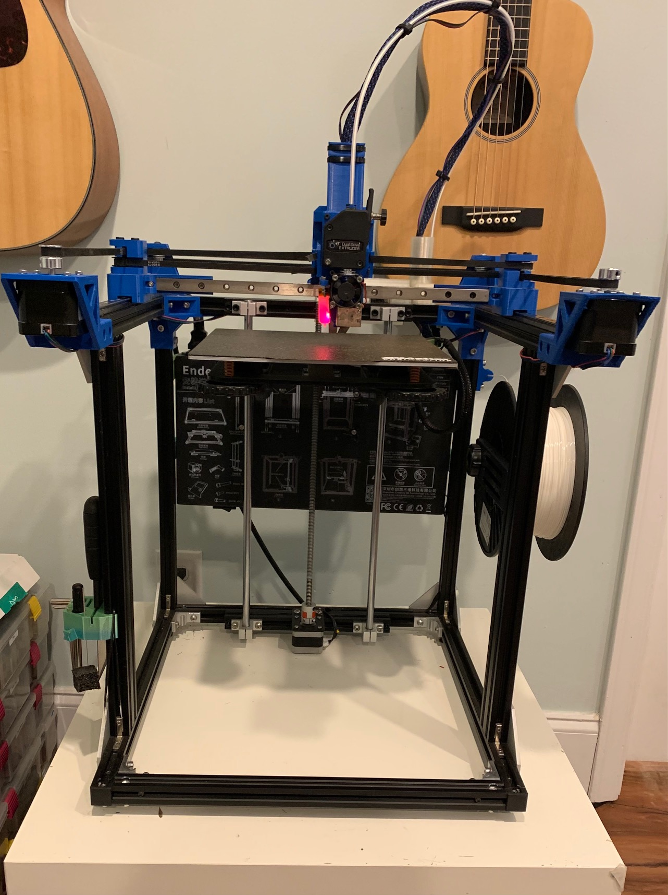
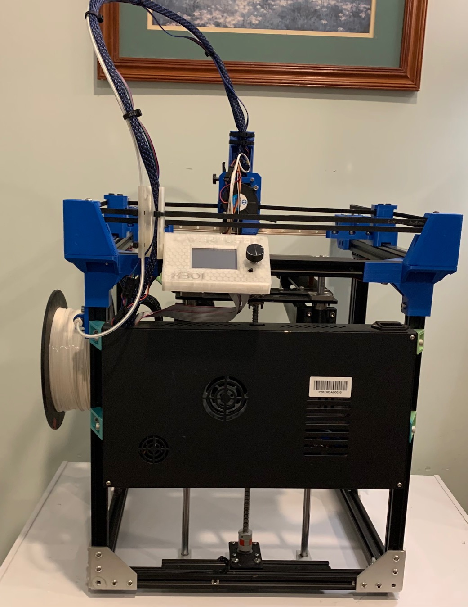
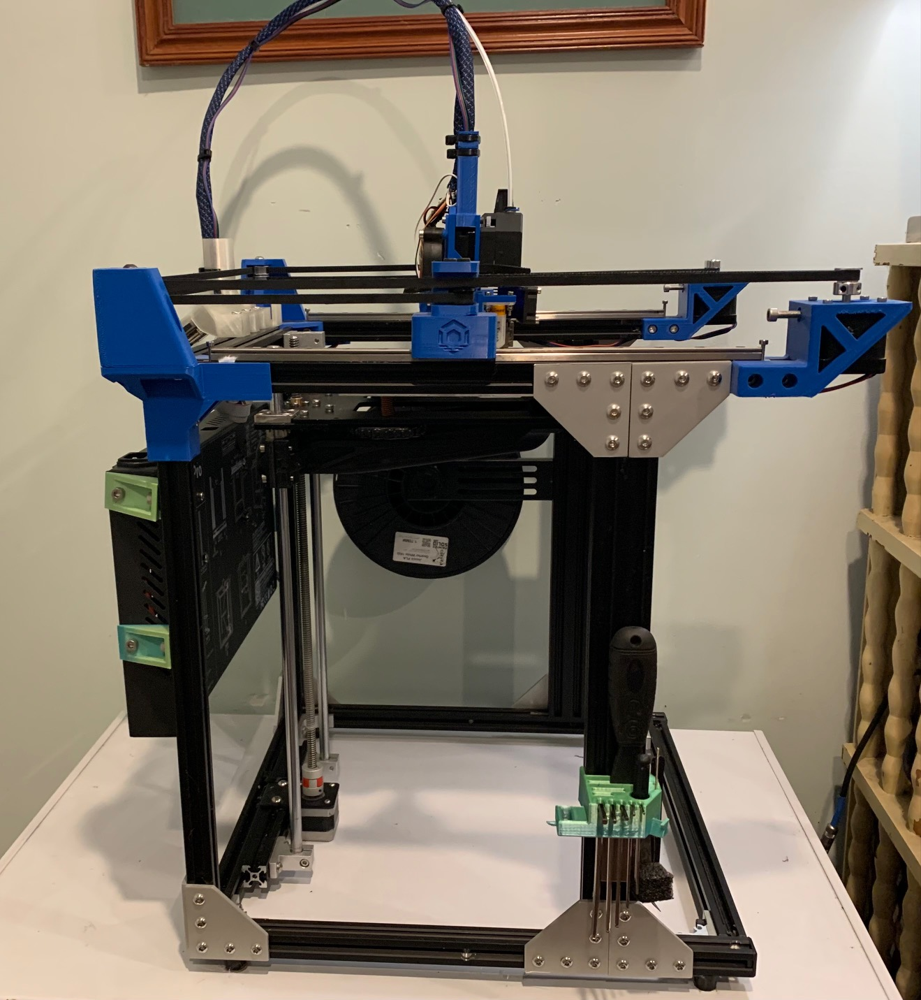
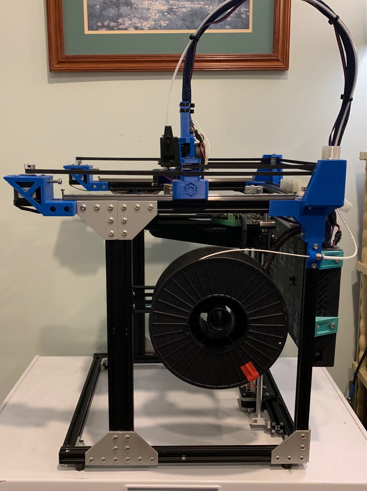
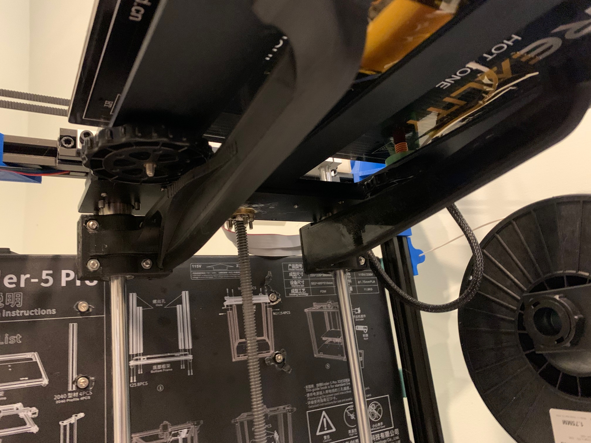

# Ender 5 Pro to CoreXY Conversion using the LayerFused X301 as a base.

1. [PETG/CF](https://atomicfilament.com/products/carbon-fiber-black-petg-pro) for the struts
2. Relocation of electronics box 
3. [Buck converter](https://www.amazon.com/gp/product/B07ZMRN1B2) from 24v to 5v 3A
4. [Raspberry Pi + SD Card for OctoPrint](https://www.amazon.com/gp/product/B07V58CQGR/)
5. [SKR 1.4 Turbo](https://amzn.to/2SnLvbf)
6. [4x TMC2209](https://amzn.to/2KP0x5C)
7. [BLTouch with 2M extension cable](https://www.amazon.com/gp/product/B07FR2LLZP/)
8. CoreXY conversion parts printed via the LayerFused X301 Parts:
- LayerFused Store: 
  * [affiliate link](https://shop.layerfused.com/collections/all-products/products/x301-printed-parts-kit?aff=5)
  * [non-affiliate link](https://shop.layerfused.com/collections/all-products/products/x301-printed-parts-kit)
-  print your own:
    * [LayerFused BitBucket](https://bitbucket.org/makersmashup/x301-models/src/master/STL/)
      * [1x - Mainboard Mount](https://bitbucket.org/makersmashup/x301-models/src/master/STL/Mainboard%20Mount.stl)
      * [1x - XY Motor Bracket Left](https://bitbucket.org/makersmashup/x301-models/src/master/STL/XY%20Motor%20Bracket%20Left.stl)
      * [1x - XY Motor Bracket Right](https://bitbucket.org/makersmashup/x301-models/src/master/STL/XY%20Motor%20Bracket%20Right.stl)
      * [2x - XY Bracket Top Teeth Smooth](https://bitbucket.org/makersmashup/x301-models/src/master/STL/XY%20Bracket%20Top%20Teeth.stl)
      * [2x - XY Bracket Top Smooth](https://bitbucket.org/makersmashup/x301-models/src/master/STL/XY%20Bracket%20Top%20Smooth.stl)
      * [1x - Rear Pulley Bracket Right](https://bitbucket.org/makersmashup/x301-models/src/master/STL/Rear%20Pulley%20Bracket%20Right.stl)
      * [1x - Rear Pulley Bracket Left](https://bitbucket.org/makersmashup/x301-models/src/master/STL/Rear%20Pulley%20Bracket%20Left.stl)
      * [2x - Rear Corner Brackets](https://bitbucket.org/makersmashup/x301-models/src/master/STL/Rear%20Corner%20Bracket%20Top%20v2.stl)
      * [1x - Display Case](https://bitbucket.org/makersmashup/x301-models/src/master/STL/TFT24%20Display%20Case%20-%20LayerFused%20X301.stl)
      * [1x - XY Bracket Bottom Left](https://bitbucket.org/makersmashup/x301-models/src/master/STL/XY%20Bracket%20Bottom%20V2%20Left.stl)
      * [1x - XY Bracket Bottom Right](https://bitbucket.org/makersmashup/x301-models/src/master/STL/XY%20Bracket%20Bottom%20V2%20Right.stl)
      * [1x - Volcano Part Cooling Duct](https://bitbucket.org/makersmashup/x301-models/src/master/STL/Part%20Cooling%20Duct.stl)
      * [1x - Part Cooling Fan Mount](https://bitbucket.org/makersmashup/x301-models/src/master/STL/Cooling%20Fan%20Mount%20Plate.stl)
      * [1x - Carriage Plate](https://bitbucket.org/makersmashup/x301-models/src/master/STL/Carriage%20Plate%20P3%20Printer.stl)
      * [2x - Carriage Belt Clamps](https://bitbucket.org/makersmashup/x301-models/src/master/STL/Carriage%20Belt%20Clamp.stl)
      * [1x - Carriage Belt Body](https://bitbucket.org/makersmashup/x301-models/src/master/STL/Carriage%20Belt%20Body.stl)
      * [1x - Rear Cable Mount](https://bitbucket.org/makersmashup/x301-models/src/master/STL/Rear%20Cable%20Mount.stl)
9. Replaced Landy PSU with a [Meanwell 350w PSU](https://www.amazon.com/gp/product/B07VRK86SP/)
10. [4x 400mm 2020 extrusion](https://www.amazon.com/gp/product/B085T49MFB)
11. [Inside Connector L Bracket](https://amzn.to/3bVjEXz)
12. [BMG Style Geared Extruder (Opens on right side)](https://amzn.to/2Lis5k2)
13. VolcanoStyle hotend (2 options - if LayerFused, skip 13/14):
  * [LayerFused - affiliate link)](https://shop.layerfused.com/collections/printer-kits/products/layerfused-volcano-hotend-kit-24v?aff=5)
  * [Zyltech](http://www.zyltech.com/new-volcano-style-hotend-1-75mm-bowden-conversion-kit/) 
14. [Microswiss Plated Volcano heatbreak](https://www.amazon.com/gp/product/B06WGRJK1B/)
15. [Authentic E3Dv6 Volcano block](https://www.amazon.com/gp/product/B07BFYL3KN/)
16. [Various M3/M5 T-nuts and regular nuts.](https://www.amazon.com/gp/product/B0734NVR48/ref=ppx_yo_dt_b_search_asin_title?ie=UTF8&psc=1)
17. [Pancake Stepper Motor](https://amzn.to/2VTFWnl)
18. [Aluminum Alloy T Slot L Shape Joining Plate w/ (50)M5x8 Hex Screws & (50) T-Nuts](https://amzn.to/2WaB5Nl)
19. [GT2 Belt \(At least 5Meters\)](https://amzn.to/2LcJdrm)
20. [6x - GT2 5mm Bore 6mm Width Aluminum Timing Belt Idler Pulley](https://amzn.to/2XsKKAL)
21. [2x - GT2 5mm Bore 6mm Width Aluminum Timing Belt Idler Pulley Toothless](https://amzn.to/2KOjHsi)
22. [GT2 Pulley 20 Teeth 5mm bore 6mm Width 20T](https://amzn.to/2XzrmRz)
23. [TFT 2.4 Inch Touch Screen Display RepRap Smart Controller Panel](https://amzn.to/2KMIeyb)
24. [5015 Blower Fan](https://amzn.to/2Zxyroj)
25. [Raspberry Pi Electronics Mount from Thingiverse](https://www.thingiverse.com/thing:4140386)
26. [3x 350mm MGN12H Linear Rails](https://www.amazon.com/gp/product/B081Q4FHBW/)
27. [2020 Snap in cable clips](https://www.thingiverse.com/thing:1561292)
28. [2x High Torque Stepper Motors](https://www.amazon.com/Usongshine-Stepper-17HS4401-Connector-Printer/dp/B07C1MVTZC/)
29. [Struts](https://www.thingiverse.com/thing:3661405) to deal with the cantilevered design issues with the bed having too much play.

I used the LayerFused X301 build videos as a guide for assembling this and configuring the firmware. The video series is [here on youtube](https://www.youtube.com/watch?v=JwKp_6I6MR4&list=PLyYZUiBHD1QgZ4tn9tMU3Z-l71JyhPW9l).

The specific videos that deal with the motion system are parts 2-4.
LayerFused also has [Wiki](https://wiki.layerfused.com/en/home) with a printing [guide](https://wiki.layerfused.com/en/X301/printing-guide).

The [MakersMashup Discord](https://discord.gg/zym4tSjgeR) is also available to talk with other makers or myself.

E5PCXY Front

E5PCXY Back

E5PCXY Left

E5PCXY Right

E5PCXY Bed Struts:

